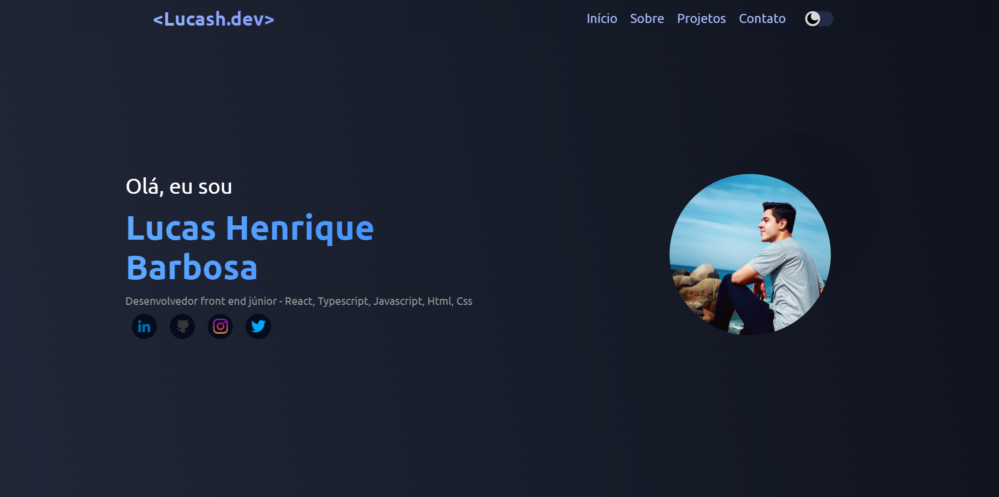

<div align="center">
	<h1>Portifólio</h1>
</div>


> :eyes: Meu portifólio pessoal criado com reactjs 

<br>
                                                  


## Técnologias utilizadas
- React
- Typescript
- Styled Components
- React-router-dom
- Fetch API

## 🚀 Acesso
Para acessar o deploy utilize o link abaixo
<br>
[Portifólio ↗️](https://lucash-barbosa.vercel.app)

## 🛠️ Abrir e rodar o projeto

### Setup de ambiente
- [Node 16.17.1](https://nodejs.org/en/)

### Rodar o projeto
- Clone o projeto ```git clone https://github.com/lucash-barbosa/Portifolio.git```
- Rode ```npm install```
- Rode ```npm start```
- Abra o projeto no navegador pelo link <a href="http://localhost:3000/">http://localhost:3000/</a>
